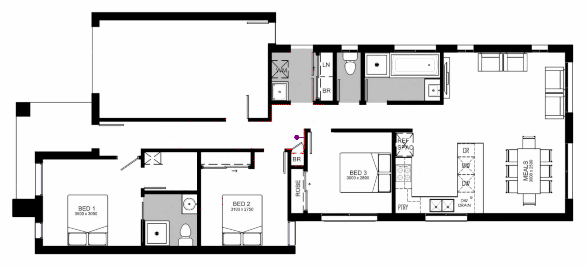

# Pose Graph SLAM Implementation

*Demonstration of simulated mobile robot with 2D laser scanner*

*Demonstration of the Iterative Closest Point algorithm aligning two point clouds*

# How to run
- Install [rust](https://www.rust-lang.org/learn/get-started)
- Clone the repository:
`git clone https://github.com/owenbrooks/cram.git`
- Change directory: `cd cram`
- Run the laser scanner demo using `cargo run`
- Run the iterative closest point demo using `cargo run --example icp_demo`
